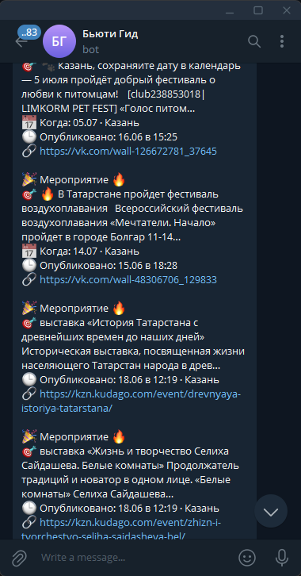
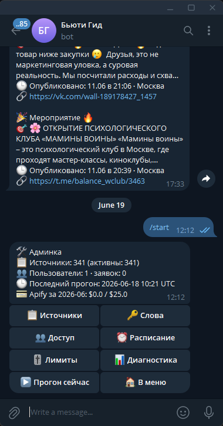
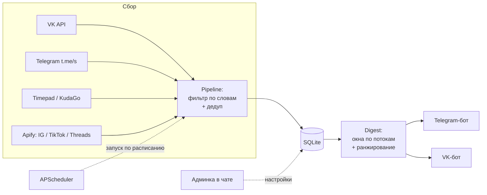

# Beauty Monitor Bot · кейс

> Бот мониторинга бьюти-ниши по городам: раз в период собирает посты конкурентов, блогеров и афиш из соцсетей и присылает дайджест в Telegram и VK. Управление — через админку прямо в чате.


> 🔒 **Закрытый проект.** Это витрина-кейс: архитектура, решения и результаты. Исходный код приватный — готов показать по запросу (доступ к приватному репозиторию или live-демо на созвоне).

---

## Проблема
Бьюти-студии важно видеть, что делают конкуренты, о чём пишут локальные блогеры и какие профильные мероприятия скоро пройдут. Мониторить десяток пабликов руками — долго и нерегулярно. Нужен инструмент, который соберёт это сам и отдаст короткую сводку по каждому городу.

## Что делает
- Собирает три потока контента и шлёт **дайджест по расписанию** (неделя/месяц) в Telegram и VK.
- **📌 Конкуренты** — посты бьюти-студий (берём всё).
- **🌟 Блогеры** — инфлюенсеры, отфильтрованные по ключевым словам.
- **📅 Мероприятия** — паблики/СМИ + Timepad + KudaGo, показываем предстоящие.
- Полное управление через **админку в чате**: источники, ключевые слова, лимиты, расписание, бюджет, ручной запуск и диагностика последнего прогона.

## Демо
<!-- Замените на свои реальные скриншоты (см. docs/screenshots) -->
| Дайджест | Админка |
|---|---|
|  |  |

## Источники данных
| Источник | Как | Стоимость |
|---|---|---|
| VK | официальный API (`wall.get`) | бесплатно |
| Telegram | публичный `t.me/s/` | бесплатно |
| Timepad / KudaGo | публичные API мероприятий | бесплатно |
| Instagram / TikTok / Threads | через Apify-акторы | платно, под бюджетным лимитом |

## Стек
**Python 3.12** · **aiogram 3** (Telegram) · **vkbottle** (VK) · **APScheduler** (расписание) · **httpx + BeautifulSoup** (сбор) · **SQLite** (хранилище) · **Docker / docker-compose** · **Apify API**.

## Архитектура
Подробно — в [`docs/ARCHITECTURE.md`](docs/ARCHITECTURE.md). Кратко поток данных:



## Инженерные решения
Несколько вещей, которыми я доволен (фрагменты ниже — **упрощённые**, для иллюстрации подхода).

### 1. Защита бюджета на платных источниках
Apify тарифицируется за объём, поэтому перед каждым прогоном проверяется остаток месячного потолка, а реальный расход пишется в БД. Профили одной соцсети собираются **одним батч-прогоном**, чтобы не платить за каждый запуск отдельно.

```python
def can_spend(conn, est_usd: float, monthly_cap: float, per_run_cap: float) -> bool:
    spent = month_spent_usd(conn)            # сколько уже потратили в этом месяце
    if est_usd > per_run_cap:
        return False                         # один прогон не дороже потолка
    return (spent + est_usd) <= monthly_cap  # и не вылезаем за месячный лимит
```

### 2. Окно показа зависит от потока
Для разных потоков «релевантно» — это разное по времени: мероприятия показываем вперёд (что скоро будет), блогеров — назад (что писали за период), конкурентов — в обе стороны.

```python
def in_stream_window(post, now, days):
    back, fwd = now - timedelta(days=days), now + timedelta(days=days)
    if post.stream == "events":
        return post.event_at and now - timedelta(days=1) <= post.event_at <= fwd
    if post.stream == "competitors":
        return back <= post.published_at <= fwd
    return back <= post.published_at <= now      # bloggers — только назад
```

### 3. Ранжирование по релевантности
В дайджест попадает ограниченное число постов на поток, поэтому они сортируются по совпадению бьюти-слов (с бонусом за попадание в начало текста и за свежесть), а не просто по дате.

## Результат
- Один дайджест заменяет ручной обход ~10–15 источников по каждому городу.
- Платные источники под жёстким бюджетным потолком — расход предсказуем.
- Полностью настраивается под клиента из чата, без правки кода.

## Ограничения и развитие
- Хранилище — локальный SQLite; для мультиклиентского прода вынес бы в PostgreSQL.
- Сбор IG/TikTok/Threads зависит от сторонних Apify-акторов.
- Telegram читается через публичный `t.me/s/` — закрытые каналы недоступны.

## Доступ к коду
Репозиторий с исходниками приватный. Покажу по запросу: выдам доступ к приватному репозиторию или проведу live-демо. Напишите — [Telegram](https://t.me/baylov93) · aimbaylov@gmail.com

---
© 2026 Ilya Baylov. Проприетарный проект. Этот репозиторий содержит только документацию кейса.
