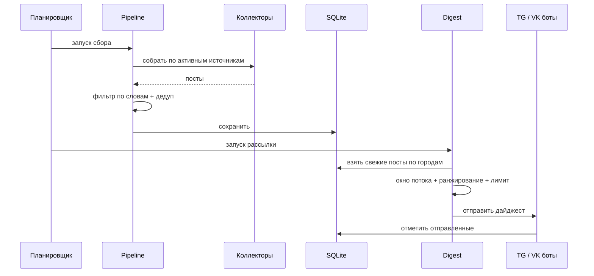

# Архитектура

## Поток данных
1. **Планировщик** (APScheduler) по расписанию запускает сбор, либо админ запускает вручную из чата.
2. **Коллекторы** тянут посты из источников:
   - бесплатные — VK API, Telegram (`t.me/s/`), Timepad, KudaGo;
   - платные — Instagram / TikTok / Threads через Apify (батч-прогон на соцсеть, под бюджетным потолком).
3. **Pipeline** фильтрует посты по ключевым словам (кроме потока «Конкуренты»), обогащает мероприятия датой события и дедуплицирует.
4. Посты сохраняются в **SQLite**.
5. **Digest** для каждого пользователя и города отбирает посты по окну показа потока, ранжирует по релевантности, обрезает до лимита и форматирует карточки.
6. **Боты** (Telegram, VK) отправляют дайджест; отправленное помечается, чтобы не дублировать в следующий раз.

## Модули
| Модуль | Зона ответственности |
|---|---|
| `config` / `settings` | переменные окружения и дефолты/пресеты UI |
| `models` / `db` | модель поста и слой доступа к SQLite |
| `collectors/*` | сбор из VK, Telegram, Apify (IG/TikTok/Threads), событий |
| `dedup` | защита от повторной отправки |
| `budget` | контроль расхода Apify (месячный и поразовый потолки) |
| `pipeline` | оркестрация сбора и рассылки |
| `digest` | окна показа, ранжирование, форматирование карточек |
| `scheduler_store` | хранение и применение расписания |
| `bots/*` | Telegram- и VK-боты + общая логика админки |

## Ключевые принципы
- **Единый источник правды для настроек** — периоды, лимиты и пресеты описаны в одном месте, реальные значения живут в БД.
- **Бюджет прежде всего** — платные источники никогда не запускаются без проверки остатка лимита.
- **Идемпотентность рассылки** — отправленные посты помечаются, повторов в следующем дайджесте нет.
